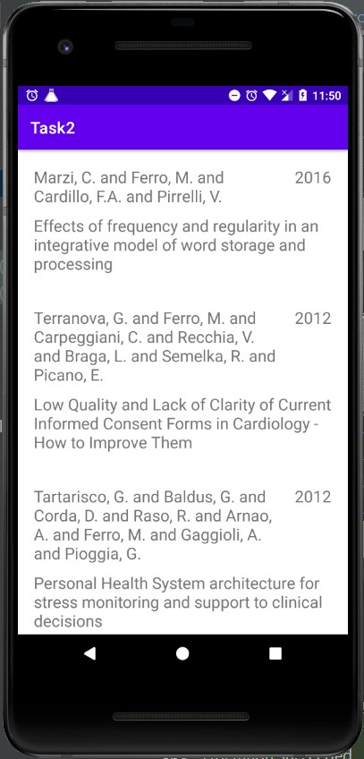

# Лабораторная работа №4. RecyclerView.
## Цели
  - Ознакомиться с принципами работы adapter-based views.
  - Получить практические навки разработки адаптеров для view
## Программа работы
#### Задача 1. Ознакомьтесь со strict mode библиотеки, проиллюстрировав его работу unit-тестом.
Рассматриваемая библиотека имеет 2 флага, требующих тестирования функциональности. Первый из них отвечает за контроль повторных вызовов entry в режиме strict. Значение ограничения можно менять (сейчас стоит 20). Normal mode снимет это ограничение. Второй флаг, shuffle, отвечает за перемешивание элементов. Тестирование режиима strict основано на тестировании режима normal: при вызове N+1 элемента отлавливаем IllegalStateException. Для тестирования второго флага был взят bib файл из второго задания. База данных перемешивалась 10 раз, и если хотя бы 1 из резульатов отличался от первого, тест проходил. Конечно, существует вероятность непрохождения теста, но для 100 элементов и 10 повторов она ничтожно мала. Код написанных unit-тестов приведен ниже.

```
@Test
  public void strictModeThrowsException() throws IOException {
    BibDatabase database = openDatabase("/articles.bib");
    BibConfig cfg = database.getCfg();
    cfg.strict = true;
    boolean exc = false;

    BibEntry first = database.getEntry(0);
    for (int i = 0; i < cfg.maxValid - 1; i++) {
      BibEntry unused = database.getEntry(0);
      assertNotNull("Should not throw any exception @" + i, first.getType());
    }

    try{
      BibEntry unused = database.getEntry(0);
      first.getType();
    } catch (IllegalStateException e) {
      exc = true;
    }

    assertTrue(exc);
  }

  @Test
  public void shuffleFlag() throws IOException {
    BibDatabase database = openDatabase("/articles.bib");
    BibConfig cfg = database.getCfg();
    cfg.shuffle = true;
    boolean shuffle = false;

    for (int count = 0; count < 10; count++) {
      BibDatabase shuffled = openDatabase("/articles.bib");
      for (int i = 0; i < database.size(); i++) {
        if (!database.getEntry(i).equals(shuffled.getEntry(i))) shuffle = true;
      }
    }

    assertTrue(shuffle);
  }
}
```

После написания и прохождения всехтестов проект был собран в jar для дальнейшего использования во второй и третьей задачах. 

___

#### Задача 2. Знакомство с RecyclerView.
Написать Android приложение, которое выводит все записи из articles.bib файла на экран, используя предложенную библиотеку и RecyclerView.
Приложение реализовано в 3 классах: MainActivity, Adapter и ViewHolder.

   - MainActivity содержит подключение к RecyclerView адаптера, который отвечает за подгрузку данных к ViewHolder'ам, и LayoutManager, который в данном приложении будет Liner для отображения всех элементов в список.

```
class MainActivity : AppCompatActivity() {
    override fun onCreate(savedInstanceState: Bundle?) {
        super.onCreate(savedInstanceState)

        val binding = ActivityMainBinding.inflate(layoutInflater)
        setContentView(binding.root)

        val linearLayoutManager = LinearLayoutManager(this, RecyclerView.VERTICAL, false)
        val viewAdapter = Adapter(resources.openRawResource(R.raw.articles))

        binding.recyclerView.apply {
            setHasFixedSize(true)
            layoutManager  = linearLayoutManager
            adapter = viewAdapter
        }
    }
}
```

   - Adapter полуает на вход inputStream для чтения из базы данных и переопределяет 3 основных метода: getItemCount(), возвращающий размер базы данных, создающий новый элемент списка и возвращающий объект класса ViewHolder, отвечающий за отображение данных во view. Третий метод onBindViewHolder получает на вход объект ViewHolder и загружает в него данные с нашей базы данных.

```
class Adapter(inputStream: InputStream): RecyclerView.Adapter<ViewHolder>() {
    private var database: BibDatabase

    init {
        InputStreamReader(inputStream).use { reader ->
            database = BibDatabase(reader)
        }
    }

    override fun onCreateViewHolder(parent: ViewGroup, viewType: Int): ViewHolder {
        val inflater = LayoutInflater.from(parent.context)
        return ViewHolder(ItemLayoutBinding.inflate(inflater, parent, false))
    }

    override fun onBindViewHolder(holder: ViewHolder, position: Int) {
        holder.bindEntry(database.getEntry(position))
    }

    override fun getItemCount(): Int {
        return database.size()
    }
}
```

   - ViewHolder класс имеет единственный метод, соединяющий текстовые поля лэйаута с данным из базы.

```
class ViewHolder(private  val binding: ItemLayoutBinding) : RecyclerView.ViewHolder(binding.root) {
    fun bindEntry(entry: BibEntry) {
        binding.author.text = entry.getField(Keys.AUTHOR)
        binding.title.text = entry.getField(Keys.TITLE)
        binding.year.text = entry.getField(Keys.YEAR)
    }
}
```

Готовое приложение имеет вид, представленый ниже на Рис.1. За отображения отвечают 2 layout файла. acticity_main содержит сам RecyclerView, а item_layout описывает элемент списка, состоящий из констрейнт лэйаута, содержащего в себе 3 текстовых поля для автора, года и заголовка. Этих данных достаточно как с точки зрения разработки, так как наличие элементов со всеми 3 одинаковыми полями маловозможно, так и для пользователей, которым будет удобно искать статью по её названию, автору или году публикации.

*Рис. 1. Общи вид приложения*


___

#### Задача 3. Бесконечный список
Реализовать аналог приложения из предыдущей задачи с бесконечно прокручиваемым списком.
Решение заключается в сосздании альтернаивного класса Adapter, переопределяющего метод следующим образом:
```
override fun getItemCount(): Int = Int.MAX_VALUE
```
Размер базы данных фактически изменяется на очень большое число Int.MAX_VALUE (не бесконечное, но достаточное для тестирования ммногократного потовторного отображения базы данных). Так же создана переменная, для обновления индексирования базы данных:
```
private val Int.current: Int get() = this % database.size()

```
Таким образом выгрузка данных из базы производится не по position, а по position.context.

## Вывод
В ходе выполнения лабораторной работы были изучены возможности работы с библотеками и создание подключение собственной как зависимости, а также принципы разработки, основанные на использовании RecyclerView и Adapter. Полученные знания были отработаны на практике, создано приложение, загружающее сведения о заметках из базы данных и отображающее их в списке с возможностью бесконечного отображения и обновления.